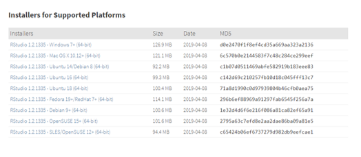

---
title: "Manual de Probabilidad y Estadística"
output: html_notebook
---

### Participantes

Enrique Suarez  506161049

Aric Gutierrez  506162030

En esta sección encontrarás todos los conceptos necesarios para iniciar a trabajar con herramientas enfocadas al desarrollo de la probabilidad y la estadística.

### Instalación de R
1.	lo primero que se debe hacer es instalar R, para eso deberá Dirigirse al siguiente link: https://cran.r-project.org/ dependiendo del sistema operativo de su dispositivo escoja una de las siguientes opciones:

#

2. Consecuentemente este nos direcciona a otra página en la cual podemos descargar R dándole click en Download. Así descargamos la versión más reciente.

#

Una vez descargado el programa, procedemos a la instalación

### Pasos 

PASO 1: Seleccionar idioma

#

PASO 2: Continuando con la opción "siguiente", seleccionamos la opción de 32-bit files o 64-bit files dependiendo de las propiedades de nuestro dispositivo. 

#

PASO 3: Una vez seleccionado, continuamos dando en la opción "siguiente" dando como apertura a la finalización de la intalación.

#

### Instalación R Studio
1. Para instalar RStudio entraremos al siguiente link: https://www.rstudio.com/products/rstudio/download/,En esta página se muestran los diferentes servicios por la misma versión de R, para nuestro caso elegiremos la primera opción “RStudio Desktop”

#

2. De la misma manera que hicimos para R, aquí seleccionaremos nuestro sistema operativo:

#

Una vez seleccionado, continuamos dando en la opción "siguiente" dando como apertura a la finalización de la intalación.

### Paquetes R

Es importante saber cómo instalar paquetes en R, ya que en ocaciones para realizar una acción en este sistema se necesita de un paquete en específico que contenga la operación que necesitamos realizar.

Para instalar un paquete existen 2 maneras:

1.	Por consola: Para realizar esta acción en la consola deberemos escribir el siguiente comando “install.packages(“nombre del paquete”).
2.	La segunda manera se realiza dando clic en “Tools” y seguido “Install Packages” como se ve en la siguiente imagen.

#

Acto seguido nos aparecerá una interfaz en donde podemos escribir el paquete que deseemos instalar.

#

Rstudio presenta una ayuda para saber cómo funcionan los diferentes paquetes que existen y como pueden ser usados. Para ello, se puede ingresar a la siguiente opcion:

#


## Gráficas

### Definición 

Un gráfico Excel es una representación gráfica de ciertos valores que nos permite hacer una comprobación comparativa de manera visual. Los gráficos en Excel son una de las herramientas más
potentes que nos ofrece Microsoft para hacer informes, análisis de datos.
El objetivo a conseguir con los gráficos de Excel será conseguir que la información mostrada se
entienda mejor que los números en sí mismos.

## Tablas

### Tablas de frecuencia 
Los datos cuantitativos discretos se organizan en tablas, llamadas Tablas de Distribución de
frecuencias. La primera columna de la tabla contiene los distintos valores que asume la variable
ordenados de menor a mayor y las restantes columnas contienen los siguientes tipos de frecuencias.
  • Frecuencia absoluta: Indica el número de veces que se repite un valor de la variable.
  • Frecuencia relativa: Indica la proporción con que se repite un valor. Se obtiene dividiendo la
  frecuencia absoluta entre el tamaño de la muestra. Para una mejor interpretación es más conveniente
  mutiplicarla por 100 para trabajar con una Frecuencia relativa porcentual.
  • Frecuencia absoluta acumulada: Indica el número de valores que son menores o iguales que el
  valor dado.
  • Frecuencia relativa porcentual acumulada: Indica el porcentaje de datos que son menores o
  iguales que el valor dado.

```{r}
library(prob)
table=matrix(c(21,18,19,20,21,20),ncol=3,byrow=TRUE)
 rownames(table)=c('Dato 1','Dato 2')
 colnames(table)=c("Edad","Creditos","GPA")
mytable<-table
mytable
(mytable)/margin.table(mytable)
cumsum(mytable)
cumsum(mytable)/margin.table(mytable)
```
### Tablas dinámicas
Una herramienta práctica para realizar conteos o tablas de contingencia son las tablas dinámicas. Algunos programas de hojas de calculo permiten realizar tablas dinámicas de forma interactivas
```{r}

 genes = paste('MMP', sprintf("%04d",1:10), sep="")
 data = expand.grid(gene=genes, condition=c('copper', 'cheetos', 'beer', 'pizza'))
 data$value = rnorm(40)
install.packages("devtools")
library(devtools)
install_github("ramnathv/htmlwidgets")
install_github("smartinsightsfromdata/rpivotTable")
## Load rpivotTable
library(rpivotTable)


rpivotTable(data, rows="gene", col="condition", aggregatorName="Average", vals="value")
```
### Gráfico de pie
Un gráfico de pie es aquel cuya división proporcional busca representar la distribución de categorías dentro de una variable nominal u ordinal: el área del círculo representa el 100% de los casos de una variable, mientras que el área de cada división del círculo, representa el porcentaje de casos en una categoría específica de esa variable (Ritchey 2008, 80–83)
```{r}
Países <- c(10,12,4,16,8)
lbls <-c('UK', 'US','Australia', 'Alemania','Colombia')
pct <- round(Países/sum(Países)*100)
lbls <- paste(lbls,pct)
lbls <- paste(lbls,"%", sep = "")
pie(Países,labels = lbls,main = "Sobrepoblación")
```

### Gráfico de barras
En un gráfico de barras se pueden trazar datos que se organizan en columnas o filas de una hoja de
cálculo. Este tipo de gráfico muestra comparaciones entre elementos individuales. En un gráfico de
barras, las categorías se organizan típicamente a lo largo del eje vertical y los valores a lo largo del
eje horizontal.
```{r}
library(prob)
 table=matrix(c(55,110,90,50,39,40),ncol=3,byrow=TRUE)
 rownames(table)=c('viejo','joven')
 colnames(table)=c("bajo","medio","alto")
 table
 barplot(table,legend=TRUE,horiz=TRUE)
```
### Gráfico de lineas
```{r}
numeroMascotas<-c(5,1,1,2,3,3,4,5,5,6,7)
edadPersonas <- c(12, 13, 14, 15, 16, 17, 18, 19, 20, 21, 22)
plot(edadPersonas, numeroMascotas, main = "Mascotas según la edad", type = "l")
```
### Gráfico pareto
Un gráfico de Pareto, llamado así por Vilfredo Pareto, es un tipo de gráfico que contiene barras y un gráfico de líneas, donde los valores individuales se representan en orden descendente por barras, y el total acumulado se representa por la línea.
Para realizar este tipo de gráficas en R, es necesatio instalar el paquete qcc.
```{r}
library(qcc)
defect <- c(80, 27, 66, 94, 33)
names(defect) <- c("price code", "schedule date", "supplier code", "contact num.", "part num.")
pareto.chart(defect, ylab = "Error frequency")
pareto.chart(defect, ylab = "Error frequency", xlab = "Error causes", las=1)
pareto.chart(defect, ylab = "Error frequency", col=rainbow(length(defect)))
pareto.chart(defect, cumperc = seq(0, 100, by = 5), ylab2 = "A finer tickmarks grid")

```

### Gráfico de Box Plot
Un diagrama de cajas y bigotes es una manera conveniente de mostrar visualmente grupos de datos
numéricos a través de sus cuartiles.
Estos son las observaciones que uno puede hacer al ver un diagrama de cajas y bigotes (box plot):
  • Cuáles son los valores clave, tales como: el promedio, el percentil 25 medio, etc.
  • Si hay valores atípicos y cuáles son sus valores.
  • Si los datos son simétricos.
  • Cuán estrechamente se agrupan los datos.
  • Si los datos están sesgados y si es así, en qué dirección
```{r}
Hijos <-c(0,1,2,4,0,0,1,3,1,2,1,1,2,3,0,1,1,2,3,1,1,1)
boxplot(Hijos,main="Hijos Empresa",col="green",ylabel="Hijos",boder="orange")
```


### Estadística Descriptiva

La estad ́ıstica descriptiva es una parte importante de la Estad ́ıstica que se dedica a analizar y representarlos datos. Su finalidad es obtener informaci ́on, analizarla, elaborarla y simplificarla lo necesario para que puedaser interpretada c ́omoda y r ́apidamente y, por tanto, pueda utilizarse eficazmente para el fin que se desee. A continuación, mostraremos como obtener algunas de estas medidas descriptivas en Rstudio.

## La media

Devuelve el promedio (media aritmética) de los argumentos.

#

En Rstudio existe la función mean(), el cual se utiliza para sacar directamente la media.

Para realizar la media debemos declarar un vector en R con los datos de nuestro interés, en  nuestro caso será el siguiente:
datos <-c(1,5,4,8,9,10,12,15,16,17):
Luego, ejecutamos el mean de nuestro vector y obtendremos el promedio de  nuestros datos que sería:
```{r}
datos <-c(1,5,4,8,9,10,12,15,16,17)
mean(datos)
```

## Mediana

Este concepto, se define  como el valor en el medio cuando los datos son ordenados de menor a mayor. En RStudio existe la función median(), la cual se utiliza para obtener directamente la mediana:

```{r}
hijos <-c(1,4,3,2,5,2,6,2,7,3)
median(hijos)
```

## Media Geométrica

La media geométrica es otra forma de describir el valor central de un conjunto de datos, se define como:

#

Para realizar la Media geométrica  en R debemos tener un conjunto de datos que tienen que ser estrictamente positivos y mayores a 0  que en nuestro caso será el siguiente:

datos <-c(1,5,4,8,9,10,12,15,16,17)

Para hallar la media geométrica de una manera sencilla en R, debemos hacer el producto de todos nuestros datos y elevar el resultado a 1/n en donde n es el número de datos:
```{r}
datos <-c(1,5,4,8,9,10,12,15,16,17)
prod(datos)^(1/10)
```

## Moda

La moda, es otra forma de describir el valor central de un conjunto de datos, ésta se calcula como el valor más frecuente. 

1. Se crea una función llamada moda.

2. Creamos nuestro vector con los datos deseados:

hijos <-c(1,4,3,2,5,2,6,2,7,3)

```{r}
moda=function(x) {
	q=table(x)
	q=sort(q,TRUE)
	return(q[1])
 	}

hijos <-c(1,4,3,2,5,2,6,2,7,3)
moda(hijos)
```

## Máximo

Es el mayor valor que puede tomar una distribución. En RStudio existe la función max(), para calcular dicho valor.

```{r}
datos <-c(1,5,4,8,9,10,12,15,16,17)
max(datos)
```

## Mínimo

Es el menor valor que puede tomar una distribución. En RStudio existe la función min(), para calcular dicho valor.


```{r}
datos <-c(1,5,4,8,9,10,12,15,16,17)
min(datos)
```

## Varianza

La varianza es una de las medidas de dispersión más populares, la siguiente ecuación define la varianza de un conjunto de datos:

#

En RStudio, existe la función var(), para calcular la varianza.

```{r}
hijos <-c(1,4,3,2,5,2,6,2,7,3)
var(hijos)
```

## Desviación estándar

Es una medida que se utiliza para cuantificar la cantidad de variación o dispersión de un conjunto de valores de datos.
Para hallar la desviación estándar  simplemente usamos la función sd() y creamos un vector con los datos deseados:

#

```{r}
hijos <-c(1,4,3,2,5,2,6,2,7,3)
sd(hijos)
```

## Cuartiles 

Son los tres valores de la variable que dividen a un conjunto de datos ordenados en cuatro partes iguales.
Para obtener los cuartiles de los datos que deseemos debemos utilizar la función quantile() en nuestro caso vamos a realizar el siguiente procedimiento:

```{r}
hijos <-c(1,4,3,2,5,2,6,2,7,3)
quantile(hijos)
```


## Distribución de Poisson

La  distribución  de  Poisson  es  una  distribución  de  probabilidad  discreta.  Expresa  la  probabilidad  de  un número k de eventos ocurriendo en un tiempo fijo si estos eventos ocurren con una frecuencia media conociday son independientes del tiempo discurrido desde el  ́ultimo evento.

Por ejemplo, para calcular la  P(X = 1) de una Poisson(3)

```{r}
dpois(1,3)
```
## Distribución binomial

La distribución binomial es una distribución de probabilidad discreta que mide el número de  ́exitos en una secuencia de n ensayos independientes de Bernoulli con una probabilidad fija p de ocurrencia del  ́exito entre los  ensayo.

Por ejemplo:
Para calcular la P(X=3) de una Binomial(10,0.5)
```{r}
dbinom(3, 10, 0.5)
```

Para calcular la P(X=6) de una Binomial(10,0.5)

```{r}
dbinom(6, 10, 0.5)
```

Para calcular la P(X=2,1,0) de una Binomial(10,0.5)

```{r}
dbinom(c(2, 1, 0), 10, 0.5)
```


Para calcular la P(X=2,1,0) de una Binomial(10,0.5)

```{r}
dpois(1,3)
```

Para calcular la P(X<=2) de una Binomial(10,0.5)
```{r}
sum(dbinom(c(2, 1, 0), 10, 0.5))
```

Para calcular la P(X>2) de una Binomial(10,0.5)
```{r}
pbinom(2,10,0.5, lower.tail=F)
```

```{r}
dpois(1,3)
```


## Distribución normal

La distribución normal, es una de las distribuciones de probabilidad de variable continua que con más frecuencia aparece en estadistica y tambien en la teoria de probabilidades. Para realizar la distribución normal en R, debemos tener en cuenta:

-Al hallar una probabilidad en x exacta, se debe utilizar la función dnorm().
-Al hallar una probabilidad en x<=, se debe utilizar la función pbinom().
-Al hallar una probabilidad en x>=, se utilizará y activará la opción lower.tail y se colocará en FALSE, asi tendriamos el x>=pbinom(lower.tail=FALSE)


Por ejemplo: 

Para calcular la  P(Z>1) de una N(0,1)
```{r}
pnorm(1, mean = 0, sd = 1, lower.tail = F)
```


Para calcular la  P(-2<Z<2) de una N(0,1)
```{r}
pnorm(c(2), mean = 0, sd = 1) - pnorm(c(-2), mean = 0, sd = 1)
```


Para calcular la  P(0<Z<1.96) de una N(0,1)
```{r}
pnorm(1.96, mean = 0, sd = 1) - pnorm(0, mean = 0, sd = 1)
```


Para calcular la  P(Z<=z)=0,5793 de una N(0,1)

```{r}
qnorm(0.5793, mean = 0, sd = 1)
```

  
Para calcular la  P(Z>150) de una Normal de media 125 y la desviación  estándar 50.

```{r}
pnorm(150, mean = 125, sd = 50, lower.tail = F)
```

## Curtósis y Asimetría- histograma

Para este ejemplo, se simularán 10000 muestras de una distribución normal con media de 55, y desviación estándar de 4.5. Se obtendrá la curtósis y asímetria.
```{r}
ejemplo <- rnorm(n = 10000, mean = 55, sd = 4.5)

#Skewness and Kurtosis
library(moments)
skewness(ejemplo)

kurtosis(ejemplo)

#Histogram
library(ggplot2)
datasim <- data.frame(ejemplo)
ggplot(datasim, aes(x = ejemplo), binwidth = 2) + 
       geom_histogram(aes(y = ..density..), fill = 'red', alpha = 0.5) + 
       geom_density(colour = 'blue') + xlab(expression(bold('Muestras simuladas'))) + 
       ylab(expression(bold('Density')))
```


### Intérvalo de confianza y prueba de hipótesis


Para  efectuar  una  prueba  de  hipótesis  es  necesario  tener  un  interés específico en contrastar cierta  hipótesis y verificar los supuestos que la prueba requiera.  La prueba de hipótesis puede realizarse como se indica a continuación, donde previamente se verifica la normalidad de los datos.

```{r}
sobrevivencia<-c(207,381,411,673,534,294,697,344,418,554)
shapiro.test(sobrevivencia)
t.test(sobrevivencia, mu=400, alternative = "greater")
```


### ANOVA
Los procedimientos t de dos muestras permiten comparar las medias de dos poblaciones o las respuestas medias a dos tratamientos de un experimento. Sin embargo, en ocasiones necesitamos comparar más de 2 grupos. El modelo del Análisis de la Varianza (ANOVA), nos permite abordar este tipo de situaciones. La función en RStudio para realizar esto es aov()

```{r}
insectos <- c(16,11,20,21,14,7,37,32,15,25,39,41,21,12,14,17,13,17,45,59,48,46,38,47)
colores <- as.factor(c(rep(c("azul", "verde", "blanco", "amarillo"), each =6)))
boxplot(insectos ~ colores, col = c("yellow", "blue", "white","green"), ylab = "Número de insectos atrapados")
fm = aov( lm(insectos ~ colores) )
summary(fm)
```


## Chi-Cuadrado

El test estadistico de chi-cuadrado pude encontrarse en la literatura tambien como bondad de ajuste. El test de bondad de ajuste (goodness of fit tests), se le denomina asi, cuando los objetos pertenecen a una matriz de datos.

La formula estadistica está dada por:


#

Para el ejemplo, se tienen 15 hombres y 19 mujeres en un salón de clase
```{r}
frec<-c(15,19)
chisq.test(frec)
```
Los valores esperados son calculados por:

```{r}
frec<-c(15,19)
chisq.test(frec)$expected
```

El test estadístico de chi-cuadrado pude encontrarse en la literatura tambien como bondad de ajuste, según rpubs.com El test de bondad de ajuste (goodness of fit tests), se le denomina asi, cuando los objetos pertenecen a una matriz de datos.

```{r}
matrix<-matrix(c(4,11,10,13,3,4,6,8),nrow=2)
matrix
chisq.test(matrix)
```

Se observa un “Warning”, esto es debido a que posiblemente los valores esperados sean menores a cinco, o la proporción supera al 20% de las celdas, con valores observados inferiores a cinco.


### Test de independencia -Fishers Test

Fishers Test es una prueba de significación estadistica, utilizadas en el analisis de tablas de contingencia cuando los tamaños de las muestras son pequeños (y frecuencias esperadas menores a 5).


```{r}
matrix<-matrix(c(4,11,10,13,3,4,6,8),nrow=2)
matrix
fisher.test(matrix)
```

### Asimetría y Curtosís 
Esta función caracteriza el grado de asimetría de una distribución con respecto a su media. La
asimetría positiva indica una distribución unilateral que se extiende hacia valores más positivos. La
asimetría negativa indica una distribución unilateral que se extiende hacia valores más negativos.

Formula:

#

```{r}
library(moments)
x<- c(16, 32, 17, 22, 8, 21, 46, 29, 52, 79, 44)
skewness(x)
kurtosis(x)
```
